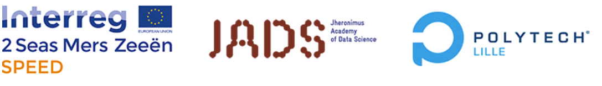
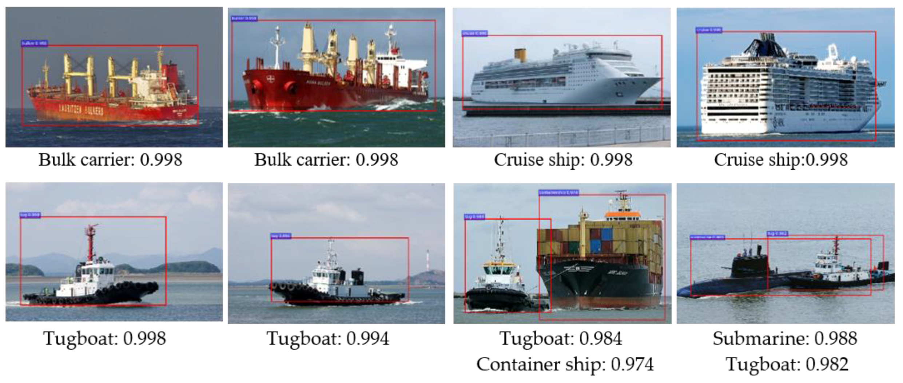
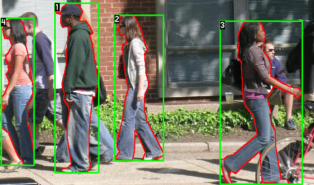
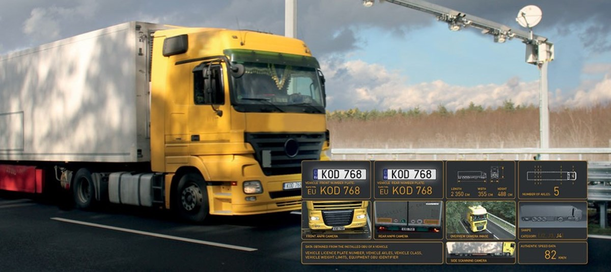
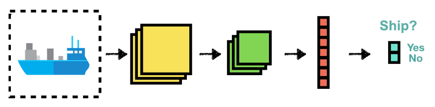
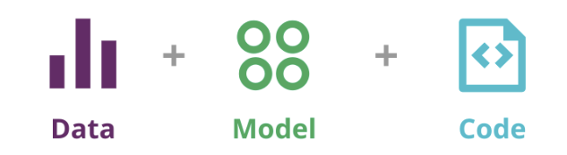
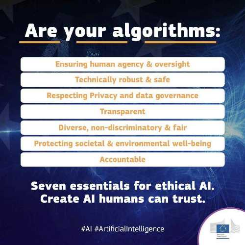

# The Interreg SPEED Datathon 2020

- [Welcome](#welcome)
- [Schedule](#schedule)
- [Goal](#goal)
- [How to Datathon - or, let the Datathon begin](#how-to-datathon---or--let-the-datathon-begin)
- [I. Choose your level](#i-choose-your-level)
  * [A - Intermediate level](#a---intermediate-level)
  * [B - Advanced level](#b---advanced-level)
- [II. Pick a challenge](#ii-pick-a-challenge)
  * [Challenge 1: Ship type categorization](#challenge-1-ship-type-categorization)
  * [Challenge 2: Person detection](#challenge-2-person-detection)
  * [Challenge 3: License plate recognition](#challenge-3-license-plate-recognition)
- [III. Run/test/score/view your trained ONNX model](#iii-run-test-score-view-your-trained-onnx-model)
- [IV. Submit your ONNX model](#iv-submit-your-onnx-model)
- [IV. The European Union's Seven Essentials for Ethical AI](#v-the-european-unions-seven-essentials-for-ethical-ai)

------

## Updates

An update for the schedule Friday December 11th 2020:

- **10:00 - Morning Q&A session**  (though feel free to ask questions in the Discord Q&A section any time!)
- **16:00 - Each (1-3 person) team presents their results: ONNX model size, model precision. Then shortly share your screen and run the model.**
  **If and when unable to complete your challenge, a short report on your teams progress is fine too. Either way, presentation are 5 minutes, maximum.** 

------

You should be able to request for a Azure student account including $100 credit here:

- https://azure.microsoft.com/en-us/free/students/

------

Additional potentially interesting link:

- https://github.com/daquexian/onnx-simplifier

------

## Welcome

Welcome to the Interreg SPEED Datathon 2020! 

The Interreg Speed Datathon is organized by the [Jheronimus Academy of Data Science (JADS)](https://www.jads.nl/aboutus.html)  and [Polytech Lille](https://www.polytech-lille.fr/) as part of the [EU Interreg SPEED](https://www.interreg2seas.eu/nl/speed) project. 

The SPEED Datathon will be focused on the application of Machine Learning and AI on IoT devices as applied to several port related challenges.

Its core challenge is to make **the smallest, still effective model** for one of the tracks outlined below. 

If you can demonstrate the running of the model (by sharing your screen), and have submitted the model itself (see below how to submit), preferably with the training and runtime source code, you  

To effectively run on simple IoT devices such as, for instance, [ESP32 WROVER based devices](https://www.tinytronics.nl/shop/en/platforms/ttgo/lilygo-ttgo-t-camera-esp32-wrover), the models should preferably be no larger than 3MB. But this may well prove too challenging! Still, it is possible - some techniques that may help are pruning, lowering the precision, etcetera... 

> Practical tip: you plan to [quantize](https://github.com/microsoft/onnxruntime/blob/master/onnxruntime/python/tools/quantization/README.md) a ML model to make it smaller, please do so *after* you have converted your model to ONNX. If you do so before ONNX conversion, quantization generally messes the conversion up. 
>
> Another practical tip: if you intend to [prune](https://www.tensorflow.org/model_optimization/guide/pruning/pruning_with_keras) [a model](https://pytorch.org/tutorials/intermediate/pruning_tutorial.html), and [quantize](https://github.com/microsoft/onnxruntime/blob/master/onnxruntime/python/tools/quantization/README.md) it as well, always *first* prune, *than* convert to ONNX, then quantize the ONNX representation.
>

Have fun playing around with our challenges. We are very curious to see what you can come up with! 

Finally, and importantly, the EU and the SPEED project are **strongly committed to fair and ethical use of AI**, as defined in its [Ethics Guidelines for Trustworthy AI](https://ec.europa.eu/futurium/en/ai-alliance-consultation). These ethical guidelines are reflected in the EU's "Seven Essentials for Ethical AI", which are summarized in [section V](#v-the-european-unions-seven-essentials-for-ethical-ai) below. 

## Schedule
**:calendar: Thursday December 10th 2020** 

- 12:00: Sharing challenges (via Discord)
- 12:00: Opening GitHub repo (including datasets)
- **13:00: Introduction (presentation and discussion)**  
- until 17:00: Q&A about the challenges and the tech stack

**:calendar: Friday December 11th 2020** 

- 10:00 – 17:00 Datathon with coaching on demand (depending on skills)
- **10:00 - Morning Q&A session** 
- **16:00 - Each (1-3 persons) team presents his or her results by shortly sharing their screen and show how they have fared**
- 17:00 – Prize ceremony (500 euro prize money)

##  Goal 

The goal of the Datathon can be succinctly stated in one sentence:

**Create an as small as possible ONNX representation of a trained model for the problem domain in question**

Specifically, we will compare the file sizes of the resulting ONNX machine learning models as a measure for model size. 

Of course, we will also take into account that your model ought to remain accurate enough to be used in practice

Of course, it will be usable to know a little more about ONNX - read more [here](https://onnx.ai/), or [here](https://github.com/onnx/tutorials). 

In summary: **ONNX is an open format built to represent machine learning models.** ONNX defines a common set of operators - the building blocks of machine learning and deep learning models - and a common file format to enable AI developers to use models with a variety of frameworks, tools, runtimes, and compilers.

Importantly, from an engineering point of view, you can differentiate between two phases in (non-reinforcement) machine learning, the **training** or creation phase, and the **deployment** phase. 

In the current challenge, the focus is on **training** a machine learning model using any existing machine learning library or service that exports to ONNX.

As long as the framework or service allows you to **export your model to ONNX**, Interreg Speed partners can then make use of the **Scailable** [platform](https://admin.sclbl.net/speed_utp.html) to  deploy the ONNX representations of the trained models to optimize, **deploy** and run them on any device, in a browser, or on most any cloud service.

So, all in all: by converting a small **trained model** (step one in the diagram above, and the main goal of this Datathon) to ONNX... 

... it can be then be **deployed**  (step two in the diagram, and <u>not</u> the main goal of this Datathon*) on any (IOT or Edge) device. 

**Though kudos if you are able to run your ONNX model on the beta version of our [Scailable platform](https://admin.sclbl.net/speed_utp.html)!*

## How to Datathon - or, let the Datathon begin

There are two challenge levels you can choose from, depending on your machine learning experience. 

1. **First choose your level**
2. **Then choose a challenge**
3. **Create a model and test it**
4. **Submit your model**

When you have fitted a model, convert it to ONNX and see if you are able to run it.

Finally, submit your model and your source code by compressing them into a ZIP, TAR, 7ZIP, or TAR.GZ file, and upload the archive to us.

If none of the participants is able to complete a model in time, quality of the submitted source code of the part of the project that has been completed will be judged instead.

## I. Choose your level 

### A - Intermediate level 

This track fits particularly well with Challenge 1 - but feel check out if you can make one of the other tracks work!

Build a simple "hardly any code necessary" AI model for one of our challenges using **Microsoft's Azure Custom Vision Service** (you should be able to apply for a free account [here](https://azure.microsoft.com/en-us/services/cognitive-services/custom-vision-service/), and [be able to export your model to ONNX](https://docs.microsoft.com/en-us/azure/cognitive-services/custom-vision-service/export-your-model)).

Also, you should be able to request for a Azure student account including $100 credit here:

- https://azure.microsoft.com/en-us/free/students/

  

**IMPORTANT:**

> When training your model make sure your choose:
>
> **General (compact)**  - both the Classification or Object Detection "compact" versions are fine, if you want to be able to use one of the [example scripts](https://github.com/Azure-Samples/customvision-export-samples/tree/main/samples/python/onnx).
>
> Otherwise, at least choose some "**compact**" type if you want to export to be able to export your model.

Remember: It will take a while to train you model! Anything between 5 minutes and hours, depending on the size of the model.

A working example of how to run a simple pretrained Vision Services exported ONNX model with just three classes:

- https://github.com/interreg-speed/speed-datathon-2020/tree/main/example_python_onnx_customvision

For more information on CustomVision.ai, see, for instance:

- https://www.customvision.ai/

- http://bearresearch.org/2020/09/no-code-image-classification-with-azure-custom-vision/

### B - Advanced level      

If you have experience with machine learning libraries, we encourage you to train your own model on the data of one of our challenges. 

Then export the trained and optimized model to ONNX. To do so, you could follow any of the following tutorials:

**Tensorflow**:

- https://blog.codecentric.de/en/2019/08/portability-deep-learning-frameworks-onnx/
- https://github.com/onnx/tensorflow-onnx

**Pytorch**:

- https://medium.com/analytics-vidhya/speedup-pytorch-inference-with-onnx-284d6a47936e
- https://pytorch.org/tutorials/advanced/super_resolution_with_onnxruntime.html

**Keras**:

- https://github.com/onnx/keras-onnx
- https://medium.com/analytics-vidhya/how-to-convert-your-keras-model-to-onnx-8d8b092c4e4f

**Caffe2**

- https://www.ibm.com/support/knowledgecenter/en/SS5SF7_1.6.2/navigation/wmlce_getstarted_caffe2ONNX.html

**Others**

- https://github.com/onnx/tutorials#converting-to-onnx-format
- https://www.mathworks.com/matlabcentral/fileexchange/67296-deep-learning-toolbox-converter-for-onnx-model-format
- https://docs.microsoft.com/en-us/windows/ai/windows-ml/convert-model-winmltools

## II. Pick a challenge 

### Challenge 1: Ship type categorization

**CHALLENGE CONTEXT**

Port and marine surveillance systems are currently mainly based on sensors such as radar and sonar, which allow detecting marine vessels and taking responsive actions. Though these systems can roughly locate where ships are located, more precise categorization of maritime vessels is of utmost importance to improve the capabilities of such systems. On location of a ship using radar or sonar, it would then be extremely useful to be able to capture it on camera and automatically identify it using computer vision and machine learning techniques. Vessel images include important clues regarding different attributes such as vessel type, category, gross tonnage, length and draught. 

Secondly, it is estimated that more than 75% of marine accidents involve human mistakes, mostly in the forms of fatigue, inadequate communication, bad judgement and incompliance. Autonomous ships, therefore, are a solution to increase safety and relieve humans from dangerous or risky activities in the oceans. A crewless vessel would be equipped with radar and GPS, but would also need to able to recognize types of ships from video images, to support hazard avoidance during a ship’s course. 

[Related Wazoku ID's: 00161, 00159, 00170, 00151]

**CHALLENGE GOAL**

The goal is to demonstrate basic, static **ship categorization** resulting in an **as small as possible ONNX model**. 

In other words: create a model that categorizes images of ships into one of 26 (or, if you prefer, one of out of five) types of ships.

Again, in the current Datathon, ONNX model file size trumps absolute accuracy .

An ONNX model with a file size of less than 3.2MB gains bonus points. Out of experience: that can be quite challenging.

Good luck!

**DATA**

The dataset we make available is inspired by *Gundogdu, Erhan, et al.'s 2016* "MARVEL" dataset. Our version of the dataset contains 136938 pictures of ships, split into 26 categories. There are several archives available. One with the full (1Gb) dataset. And then several with subsets. Feel free to pick the dataset that suits your goal best. Of course, the small five category dataset may well be all you want to use... Still, if you want to go all out, feel free to pick  one of the larger datasets!

- Download one of the datasets here: https://www.dropbox.com/sh/h76ywzzk8uvop8t/AACL-W_F2XTY8ga_mC0WJKAga?dl=0
- Categories can be found here: https://www.dropbox.com/home/datathon2020/ShipClassification?preview=ship_categories.txt
- A very basic example of another shipping categorization model: https://clorichel.com/blog/2018/11/10/machine-learning-and-object-detection/

------

### Challenge 2: Person detection

**CHALLENGE CONTEXT**

Port authorities manage the movement of people and cargo on their property. Physical security is a major element of port operations, because ports are large facilities spread out over extensive complex estates, with many elements that need to be secured: There are also offices, terminals, loading docks, customs facilities, and maintenance, storage and parking areas. These all add up to vast expanses that require vigilant patrol and monitoring, to protect not only workers and visitors but also port assets and the goods that move through those ports.

Many port authorities therefor already rely on video surveillance systems for increasing overall physical security, deploying staff for real-time remote monitoring from a control room or archived footage review for post-incident investigation. However, port authorities need a many camera's to cover their estate; to actively monitor all video would require significant investment of personnel and time; and – even with enough resources to watch or review the overwhelming volumes of video – the outcomes would still be prone to human error and distraction. 

Recognizing general human activity in ports can help ports make better use of their existing surveillance camera's, and help alert port security staff to those port areas that may warrant a closer look. By creating small algorithms or models that can run on small and cheap MCU's that can be added to existing port surveillance camera's, it is possible to make use of existing infrastructure without the need of new servers or expensive AI cloud services.

[Related Wazoku ID: 00161]

**CHALLENGE GOAL**

The goal is to demonstrate basic, static and anonymous **person detection,** resulting in an **as small as possible ONNX model** - using whatever means necessary. 

An ONNX model with a file size of less than 3.2MB gains many bonus points. Out of experience: that may prove quite challenging! 

In the current Datathon, ONNX file size trumps absolute accuracy (all within reason, of course) - curious to see what you can come up with! 

**DATA**

Annotated dataset: 

- https://www.cis.upenn.edu/~jshi/ped_html/ (main link)
- https://www.dropbox.com/sh/mz7rsxrf5i73f2y/AACrd1Vu9X19EhGZf50sIz6za?dl=0 (backup link)

Example of use of dataset:

- https://github.com/karim-Grid/Pedestrian-Detection

Feel free to use either another dataset, another approach towards modeling, or both.  As long as part of the final process makes use of an ONNX model - either fitted by you, or converted from an existing fitted model.

------

### Challenge 3: License plate recognition

**CHALLENGE CONTEXT**

In sea transport economic effectiveness, security, and environmental protection are inseparably connected to one another. Thus, it is important to create and integrate a system which would make it possible to effectively utilize people, port infrastructure and ships. Sea port management systems include port infrastructure management and truck and train loading operations. Steering and monitoring loading operations requires the identification of participants involved in the process, in particular vehicles driving around the port premises. Automatic vehicle detection through unobtrusive license plate recognition makes it possible to: react to emergency situations, manage transshipment areas, give access to vehicles, and more effectively utilize data which represent current situations at a given time in the port. 

[Related Wazoku ID's:  00156 00168 00167]

**CHALLENGE GOAL**

Generally license detection consists of (at least) two stages. First, license plate detection. Second, license plate recognition. Either or both can be implemented using neural networks. For this assignment, the implementation of one of the steps as a working ONNX model suffices. Again, the smaller the ONNX model, the better :smile:

**DATA**

The goal is to create an ONNX model that is used in a license plate detection toolchain - using whatever means necessary. 

Data including  python utility code:

https://www.dropbox.com/sh/upqf3xwf40zh1e8/AADx77LIAp1MdmQQh54hNpoHa?dl=0

Original source of the data set:

- http://www.zemris.fer.hr/projects/LicensePlates/english/results.shtml

Example of Pytorch based license plate detection:

- https://github.com/xuexingyu24/License_Plate_Detection_Pytorch

Example of a Tensorflow based license plate detection workflow:

- https://github.com/Dharun/Tensorflow-License-Plate-Detection

But there are many other examples out there! Feel free to pick and choose any method - as long as part of the final process makes use of an ONNX model - either fitted by you, or converted from an existing fitted model.

------

## III. Run/test/score/view your trained ONNX model

If you would like to test your ONNX model, you can do so by running it using, for instance, the Microsoft ONNXRuntime:

- https://github.com/microsoft/onnxruntime
- https://azure.microsoft.com/nl-nl/blog/onnx-runtime-for-inferencing-machine-learning-models-now-in-preview/
- https://thenewstack.io/tutorial-accelerate-ai-at-edge-with-onnx-runtime-and-intel-neural-compute-stick-2/
- https://github.com/microsoft/onnxruntime/blob/master/BUILD.md
- https://www.codeproject.com/Articles/5278507/Using-Portable-ONNX-AI-Models-in-Python

Or use one of many other available runtimes:

- https://github.com/onnx/tutorials#scoring-onnx-models

Useful model visualizers / tools:

- https://github.com/lutzroeder/netron
- https://github.com/Microsoft/Windows-Machine-Learning/tree/master/Tools/WinMLDashboard

## IV. Submit your ONNX model

When you have completed the challenge, please upload your ONNX model at the location below, before Friday 16:00 - if and where relevant, including source code used to train your model and code to run a minimal example. 

Compress all source code and your ONNX files into a ZIP, TAR, 7ZIP, or TAR.GZ file, and upload at the below link:

https://www.dropbox.com/request/5fIR3I4pc1cExREU8Glw

## V. The European Union's Seven Essentials for Ethical AI

